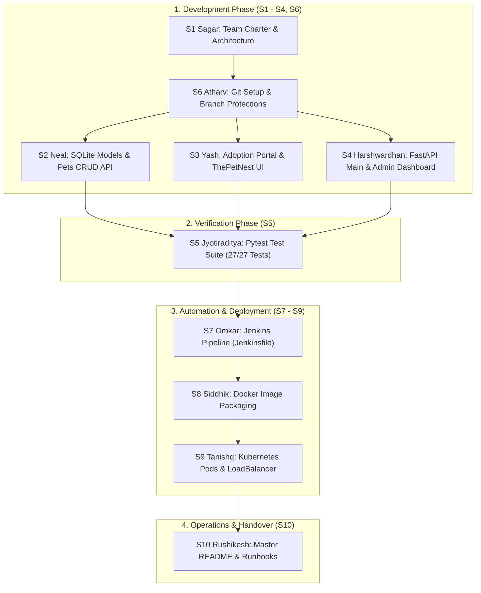

# Pet Adoption & Management System

A production-grade RESTful API and responsive web platform for managing animal shelter operations, pet registrations, and adoption workflows. Built with **FastAPI**, **SQLite**, **SQLAlchemy 2.0**, **Docker**, **Jenkins**, and **Kubernetes**.

---

## 1. System Architecture & 10-Person DevOps Workflow

The project is structured according to a strict 10-person DevOps team distribution model. Every member has dedicated deliverables with automated quality gates and CI/CD integration.



---

## 2. End-to-End Execution Plan (How The Project Is Done)

### Phase 1: Project Governance & Version Control Setup
* **Lead Engineers:** `S1_Sagar` (Team Lead) & `S6_Atharv` (Git Engineer)
* **Execution:**
  1. Sagar creates `docs/Team_Charter.md` and `docs/Project_Architecture.md` establishing GitFlow branching (`feature/<role-id>-<task>`), code review standards, and architectural diagrams.
  2. Atharv creates `.gitignore` excluding Python cache, virtual environments, and SQLite databases, and enables GitHub branch protection rules on `main`.

### Phase 2: Core Application Development
* **Lead Engineers:** `S2_Neal` (Backend Core), `S3_Yash` (Public Portal), `S4_Harshwardhan` (Admin Orchestration)
* **Execution:**
  1. **Neal (Database & Inventory API):** Configures SQLAlchemy persistence in `database.py`, models in `models.py` (`PetModel`, `AdoptionRequestModel`, `UserModel`), and CRUD routes in `routers/pets.py`.
  2. **Yash (Public Portal & UX):** Implements `routers/adoptions.py` and builds `static/index.html` styled after ThePetNest marketplace (left filter sidebar, Sangli location tags, 3-photo galleries, and modal adoption flow). Also delivers `care.html` and `services.html`.
  3. **Harshwardhan (System Orchestration & Admin):** Assembles `main.py` with CORS and clean routing (`/adopt`, `/care`, `/services`, `/admin-dashboard`), mounts admin analytics in `routers/admin.py`, and implements `static/admin.html` for reviewing and approving adoptions.

### Phase 3: Automated Quality Assurance
* **Lead Engineer:** `S5_Jyotiraditya` (QA Engineer)
* **Execution:**
  1. Manages `requirements.txt` with exact pinned dependencies.
  2. Authors `test_main.py` with 27 exhaustive tests covering health checks, input validation, cascading statuses, and adoption lifecycles using isolated database fixtures.
  3. Enforces 100% test pass rate (`pytest test_main.py`).

### Phase 4: Containerization & CI/CD Pipeline
* **Lead Engineers:** `S7_Omkar` (Jenkins CI) & `S8_Siddhik` (Docker)
* **Execution:**
  1. **Siddhik (Docker):** Builds a lightweight `Dockerfile` based on `python:3.12-slim` and configures `.dockerignore` for minimal image footprints.
  2. **Omkar (Jenkins CI):** Configures declarative `Jenkinsfile` with 5 automated stages:
     - **Checkout:** Pulls latest code from GitHub.
     - **Install:** Installs dependencies from `requirements.txt`.
     - **Test:** Executes `pytest test_main.py` (aborts if any test fails).
     - **Build Image:** Packages application into Docker container.
     - **Deploy:** Triggers Kubernetes deployment rollouts.

### Phase 5: Cloud Orchestration & SRE Operations
* **Lead Engineers:** `S9_Tanishq` (Kubernetes) & `S10_Rushikesh` (DevOps Documentation)
* **Execution:**
  1. **Tanishq (K8s):** Authors `k8s/deployment.yaml` (2 replicas with health/readiness probes) and `k8s/service.yaml` (LoadBalancer exposing port 80).
  2. **Rushikesh (SRE & Docs):** Maintains master `README.md` and operational runbooks for zero-downtime rollouts and incident recovery.

---

## 3. Team Member Distribution & Deliverables

Every member has their own dedicated directory inside `team_distribution_v2/` complete with personal `INSTRUCTIONS.md`:

| Member Folder | Member Name | Role ID & Title | Primary Deliverables |
|---|---|---|---|
| `S1_Sagar` | Sagar | S1 - Project Lead & Architect | `docs/Team_Charter.md`, `docs/Project_Architecture.md`, `docs/Design_System.md` |
| `S2_Neal` | Neal | S2 - Backend Core Engineer | `database.py`, `models.py`, `routers/pets.py` |
| `S3_Yash` | Yash | S3 - Public Portal Engineer | `routers/adoptions.py`, `static/index.html`, `static/care.html`, `static/services.html` |
| `S4_Harshwardhan` | Harshwardhan | S4 - System Orchestrator | `main.py`, `routers/admin.py`, `static/admin.html` |
| `S5_Jyotiraditya` | Jyotiraditya | S5 - QA Engineer | `requirements.txt`, `test_main.py` (27/27 tests) |
| `S6_Atharv` | Atharv | S6 - Git Governance Engineer | `.gitignore`, GitHub Branch Protection Rules |
| `S7_Omkar` | Omkar | S7 - CI/CD Pipeline Engineer | `Jenkinsfile` (5 declarative stages) |
| `S8_Siddhik` | Siddhik | S8 - Containerization Engineer | `Dockerfile`, `.dockerignore` |
| `S9_Tanishq` | Tanishq | S9 - Kubernetes Engineer | `k8s/deployment.yaml`, `k8s/service.yaml` |
| `S10_Rushikesh` | Rushikesh | S10 - DevOps & SRE Coordinator | `README.md`, Operational Runbooks |

---

## 4. API Endpoints Catalog

### System & Navigation Endpoints
| Method | Endpoint | Description |
|---|---|---|
| `GET` | `/` | API Root Health Status (`{"status": "ok"}`) |
| `GET` | `/adopt` | Public Pet Adoption Marketplace (ThePetNest style) |
| `GET` | `/care` | Pet Care Guides & Expert Articles |
| `GET` | `/services` | Pet Services & Local Clinic Booking |
| `GET` | `/admin-dashboard` | Administrative Operations Dashboard |

### Pet Inventory (`/pets`)
| Method | Endpoint | Description |
|---|---|---|
| `POST` | `/pets` | Register a new pet (`name`, `species`, `breed`, `age`, `description`, etc.) |
| `GET` | `/pets` | List all pets with optional query filters (`?species=Dog`, `?status=available`) |
| `GET` | `/pets/{pet_id}` | Retrieve details for a specific pet by ID |

### Adoption Applications (`/adoptions`)
| Method | Endpoint | Description |
|---|---|---|
| `POST` | `/adoptions` | Submit adoption application (`pet_id`, `adopter_name`, `email`, `message`) |
| `GET` | `/adoptions` | List all applications; filter by `?pet_id={id}` |
| `GET` | `/adoptions/{request_id}` | Retrieve specific adoption request |

### Administrative Operations (`/admin`)
| Method | Endpoint | Description |
|---|---|---|
| `GET` | `/admin/dashboard` | Shelter KPI metrics (`total_pets`, `available_pets`, `pending_adoptions`) |
| `PUT` | `/admin/adoptions/{id}/status` | Approve or reject an adoption (approving cascades pet to `adopted`) |
| `PUT` | `/admin/pets/{id}/status` | Update pet status (`available`, `pending`, `adopted`) |
| `DELETE` | `/admin/pets/{id}` | Remove pet record from inventory |

---

## 5. Quickstart & Verification Guide

### 1. Local Setup
```bash
# Clone the repository
git clone https://github.com/NealMR/pet-adoption-system.git
cd pet-adoption-system

# Install dependencies
pip install -r requirements.txt

# Run database seed script
python seed_pets.py

# Start development server
python -m uvicorn main:app --reload
```

### 2. Run Automated Verification Tests
```bash
pytest test_main.py -v
```
*Expected Output:* `27 passed in ~1.8s (100% pass rate)`.

### 3. Docker Deployment
```bash
# Build Docker image
docker build -t pet-adoption-system:latest .

# Run container
docker run -p 8000:8000 pet-adoption-system:latest
```

### 4. Kubernetes Deployment
```bash
kubectl apply -f k8s/deployment.yaml
kubectl apply -f k8s/service.yaml
kubectl get pods -l app=pet-api
```
