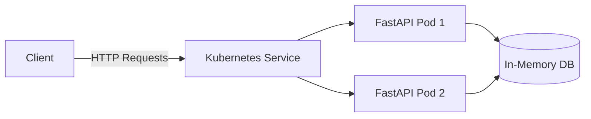
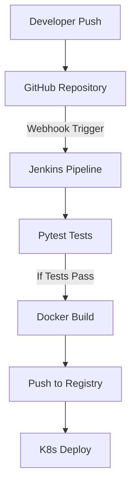

# Project Architecture

## High-Level API Architecture

## CI/CD Pipeline Diagram

## Tech Stack

| Layer | Technology | Purpose |
|-------|------------|---------|
| Backend | Python 3.9+ | Core programming language |
| API Framework | FastAPI & Pydantic | Building the REST API and data validation |
| Testing | Pytest | Automated testing for API endpoints |
| Version Control | Git & GitHub | Source code management and collaboration |
| CI/CD | Jenkins | Continuous Integration and Deployment pipeline |
| Containerization | Docker | Packaging the application into portable containers |
| Orchestration | Kubernetes | Deploying, scaling, and managing the containers |
